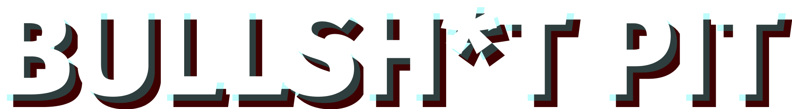

<p align="center">
    
</p>

<p align="center">
   <b>Bullsh*t Pit</b> is a presidential debate simulator <br>developed for <a href="https://itch.io/jam/gds-jam-2023"> GDS Jam 2023 </a>.
</p>

## Installation
1. Clone this repository or download it as a ZIP file
      ```bash
   git clone https://github.com/MiraZzle/bullshit-pit
   ```
2. Launch Unity and select "Open Project." Navigate to the directory where you've either cloned or extracted the game, and Unity will automatically load the project.

## How to play
1. Go to <a href="https://mirazzle.itch.io/bullsht-pit"> Bullsh*t Pit </a> itch.io page.
2. Follow **Install Instructions**.

## About our team
- <a href="https://github.com/Couleslaw"> Jakub Smolík</a> - programming
- <a href="https://github.com/tucnakomet1">Karel Velička</a> - programming
- <a href="https://github.com/Lukide0">Lukáš Koliandr</a> - programming and visuals
- <a href="https://github.com/MiraZzle">Matěj Foukal</a> - visuals and design

## Used software
In this project, [Unity](https://unity.com/) was used as the game engine of choice. All visual assets were crafted using [Figma](https://www.figma.com/).

## Commit conventions
This project follows <a href="https://www.freecodecamp.org/news/how-to-write-better-git-commit-messages/"> Conventional Commits</a>.

## Project state
This project is currently not being updated or worked on.
